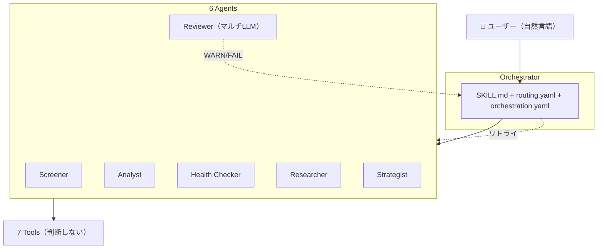
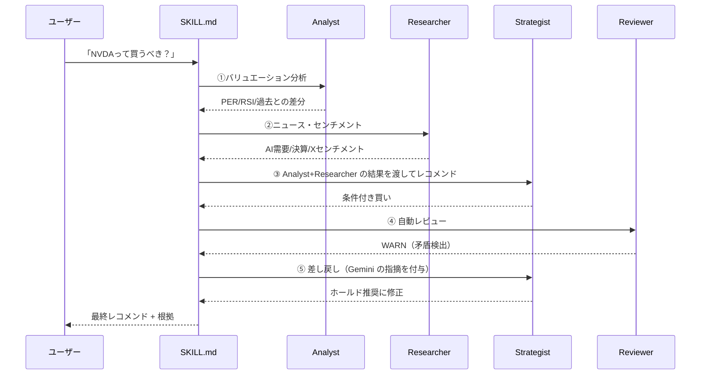

## シリーズ

- [Vol.1: 株スクリーニングを自動化した話](https://zenn.dev/okikusan/articles/eacc59ca26e566) — スクリプトで **自動化**
- [Vol.2: 使うほど賢くなる投資分析AI](https://zenn.dev/okikusan/articles/37dfaec84afec2) — GraphRAG で **学習**
- [Vol.3: 処方箋エンジン・逆張り検出・銘柄クラスタリング](https://zenn.dev/okikusan/articles/655df6dd36dfd4) — 分析機能を **高度化**
- Vol.4: 本記事 — ゼロから再設計。マルチAIエージェントで **自律化**

## はじめに

Vol.1 でスクリプトによる **自動化** を実現し、Vol.2 で GraphRAG による **学習** を加え、Vol.3 で処方箋エンジンや逆張り検出で **高度化** した。スクリプトに具体のルールを埋め込むことで、1つ1つの機能はすばやく正確に答えを出せた。

しかし、**複数の観点を連鎖させて総合判断する**ことに限界を感じていた。スクリーニングとニュースとPF診断を組み合わせて「結局どうすべきか」を導くには、スクリプト同士をどう繋ぐか、結果をどう統合するか、矛盾をどう検出するか — これらを全て人間が設計しなければならなかった。

さらに、1つ1つのステップで人間の介入が必要だった。スクリーニング結果を見て「次はこの銘柄を分析して」、分析結果を見て「ニュースも調べて」、ニュースを見て「じゃあ買うべき？」— この **human in the loop** が、せっかくの自動化の価値を下げていた。

また、スクリプトに埋め込んだ固定値（`max_per: 15` 等）では、市場環境やセクターによって的外れになる場面が増えてきた。Claude Code には文脈を読んで判断する力があるのに、スクリプトが先に固定値で判断してしまい、AI は「呼ばれた関数を実行するだけ」の存在に留まっていた。

Vol.4 ではゼロから再設計し、**6つの AI エージェントが役割分担しながら自律的に動く**マルチエージェントオーケストレーションに生まれ変わった。さらに Evaluator-Optimizer パターンの DeepThink モードで、**結論→反証→再プラン** の自律的な深掘り分析も可能にした。

ここで2つの概念が交差する:

- **Agentic AI Pattern**: ルーティング・マルチエージェント連鎖・自律修正ループなど、自律的 AI システムのアーキテクチャ設計パターン
- **Agentic Engineering**: Claude Code のようなコーディングエージェントを使い、AI と協働してソフトウェアを開発する手法

今回は **Agentic Engineering で開発し、Agentic AI Pattern で設計した**。完全なリニューアルのため、[リポジトリも新しく作り直した](https://github.com/okikusan-public/stock_skills_2)。

## 何を実現したいか

### Before / After

| | Before | After |
|:---|:---|:---|
| **ルーティング** | 549行の intent-routing.md（手書き） | routing.yaml の few-shot（数例） |
| **判断の主体** | スクリプト（固定パラメータ） | AI エージェント（自律決定） |
| **スキル数** | 9つの個別 SKILL.md | 1つの SKILL.md（オーケストレーター） |
| **出力整形** | src/output/ フォーマッター層 | エージェントが直接整形 |
| **品質保証** | なし（人間が目視） | Reviewer が自動レビュー + 差し戻し |
| **パラメータ** | コードにハードコード | few-shot のサンプル値を AI が調整 |
| **連鎖判断** | 人間がスクリプトの繋ぎ方を設計 | AI が自律的にエージェントを連鎖 |

Before では「いい株ある？」→ スクリプトが固定パラメータで実行して終わり。After では routing.yaml から Screener が選ばれ、AI が市場状況を見てパラメータを決め、結果を Reviewer がマルチ LLM で検証する。

さらに「PFを改善したい」のような複合的な質問では、Before はそもそも1つのスクリプトでは対応できなかった。After では複数エージェントが自動で連鎖する。

## 設計

### 全体アーキテクチャ



- **Orchestrator（SKILL.md）**: ユーザーの意図を解釈し、routing.yaml からエージェントを選んで起動。orchestration.yaml で自律修正ループを制御
- **6 Agents**: 各エージェントは agent.md（役割）+ examples.yaml（few-shot）の2ファイルで定義。コード不要
- **7 Tools**: 外部 API への薄いファサード。パラメータを受けて返すだけ。判断しない

### routing.yaml: どのエージェントを呼ぶか

ユーザーの意図に応じてどのエージェントを起動するかを few-shot で定義する。ルールベースではなく、代表パターンを示すだけで AI が柔軟に判断する。

```yaml
# routing.yaml
examples:
  - intent: "いい株ある？"
    agent: screener
  - intent: "トヨタってどう？"
    agent: analyst
  - intent: "PF大丈夫？"
    agent: health-checker
  - intent: "最新ニュース教えて"
    agent: researcher
  - intent: "入替提案して"
    agent: strategist
  - intent: "今熱いテーマは？"
    agents: [researcher, screener]
  - intent: "PFを改善したい"
    agents: [health-checker, researcher, strategist]
```

`agents: [health-checker, researcher, strategist]` のように複数指定すると連鎖実行になる。エージェントの実行は**直列と並列を使い分ける**:

- **直列**: 前のエージェントの結果が次の入力になる場合。Health Checker → Strategist（事実を見てレコメンド）
- **並列**: 互いに独立した分析の場合。Analyst と Researcher を同時起動し、両方の結果を Strategist に渡す

「NVDAって買うべき？」では Analyst（バリュエーション）と Researcher（ニュース）が並列で動き、両方の結果を受けた Strategist が総合判断する。「PFを改善したい」では Health Checker → Researcher → Strategist が直列で連鎖する。

投資判断を伴う場合は Reviewer が自動で追加される。

### 6エージェントの役割分担

最も重要な設計判断は **事実と判断の分離** だ。

| エージェント | 役割 | やらないこと |
|:---|:---|:---|
| 🔍 **Screener** | 銘柄探し（16プリセット × 9テーマ） | — |
| 📊 **Analyst** | 個別銘柄のバリュエーション評価 | — |
| 🏥 **Health Checker** | PFの事実・数値を出す | 判断・レコメンド |
| 📰 **Researcher** | ニュース・Xセンチメント・業界動向 | — |
| 🎯 **Strategist** | 事実を見てレコメンドを出す | データ取得 |
| 🔍 **Reviewer** | マルチLLMでレコメンドを検証 | 自分で提案 |

Health Checker → Strategist → Reviewer → ユーザー の4段階で、事実の提示・判断・検証・最終決定が分離される。

### examples.yaml: AI にパラメータを自律決定させる

各エージェントの examples.yaml に多様なパターンのサンプルを搭載。AI はこれらを参考に、状況に応じてパラメータを自律的に決定する。

```yaml
# Screener の examples.yaml（抜粋）— 数値はサンプル、AI が自律調整する
examples:
  - intent: "割安な日本株"
    params: { region: japan, preset: value, max_per: 15, min_roe: 0.08 }
    reasoning: "一般的な割安基準。市場環境によって緩めても良い"

  - intent: "AI関連の割安株"
    params: { region: us, theme: ai, max_per: 25 }
    reasoning: "成長セクターなのでPERは緩め"
```

`max_per: 25` と `max_per: 15` が共存。AI は reasoning から「成長セクターなら緩め」と学ぶ。

ただし正直に言うと、**examples.yaml は厳密な制約ではない**。エージェントがこのサンプルを必ず参照する保証はなく、全く異なるパラメータを選ぶこともありうる。これは few-shot prompting のようにプロンプトに直接注入されるわけではなく、エージェントが agent.md を読む際に「few-shotがここにある」と認識する仕組みだからだ。精度を上げるには examples のパターンを増やし、agent.md での指示を明確にしていく必要がある。これは「これから」で触れる。

### Reviewer: マルチLLMによる品質保証

3つの異なる LLM を並列で起動し、異なる視点からレビューする。

```yaml
# llm_routing.yaml
reviewers:
  risk_reviewer:    { provider: gpt,    model: gpt-5.4 }
  logic_reviewer:   { provider: gemini, model: gemini-3.1-pro-preview }
  data_reviewer:    { provider: claude, model: claude-sonnet-4-6 }
```

- **GPT**: リスク・見落とし・反論 — 多角的な視点で「見落としているリスクはないか」を突く
- **Gemini**: 矛盾・論理整合性 — 長文の文脈を読み、結論と根拠の整合性を検証する
- **Claude**: 数値の正確性 — 計算ミスや前提値の妥当性をチェックする

単一の LLM だけでレビューすると、そのモデル固有のバイアスに気づけない。**複数の LLM の強みを活かしたレビューを仕組みとして組み込む**ことで、人間がレビューしなくても一定の品質が担保される。これが Agentic AI Pattern におけるハーネスの考え方だ。

API キー未設定時は全て Claude にフォールバック（graceful degradation）。WARN/FAIL なら orchestration.yaml に従って自動で差し戻される。

### GraphRAG とポートフォリオ: 過去の文脈を踏まえた判断

各エージェントは分析の前に GraphRAG（Neo4j ナレッジグラフ）から過去のデータを自動取得する。

- **Analyst**: 「前回の分析では PER 10.8 だった。今回 9.8 に下がった」— 過去との差分を示す
- **Strategist**: 「過去に SGX 株で "100株単位で単元コストが高い" という lesson がある」— 失敗を繰り返さない
- **Reviewer**: 「前回のレビューで指摘された問題が再発していないか」— 継続的な品質向上

ポートフォリオ（CSV）も同様に、エージェントが自動で読み込んで現在の保有状況を踏まえた判断をする。「PF大丈夫？」と聞けば、Health Checker が CSV から全保有銘柄を読み出し、Yahoo Finance で最新データを取得し、テクニカル指標を計算する。Strategist は保有銘柄との重複やセクター集中を考慮してレコメンドを出す。

つまり、**過去の分析履歴・投資メモ・lesson + 現在のポートフォリオ構成**が、全てのエージェントの判断に自動的に織り込まれる。Vol.2 で作った「使うほど賢くなる」仕組みが、マルチエージェントの文脈として活きている。

### データ保存と GraphRAG

投資メモ・売買記録・ウォッチリストなどの記録系操作は、Orchestrator（SKILL.md）が直接実行する。判断が不要な単純なデータ操作なので、エージェントを起動するまでもない。

```
👤 「トヨタ100株買った」→ Orchestrator が CSV に記録 + GraphRAG に dual-write
👤 「メモして: EV戦略に期待」→ Orchestrator が JSON に保存 + GraphRAG に dual-write
```

データの保存先は2層:

- **マスター**: CSV / JSON ファイル（Claude Code の Read/Write で直接操作）
- **ビュー**: GraphRAG（Neo4j）に dual-write

GraphRAG がなくても全機能が動作する（graceful degradation）。GraphRAG があれば、過去の分析・lesson・投資メモ・売買履歴がナレッジグラフとして蓄積され、各エージェントが判断の文脈として活用できる。

tools/ には `notes.py`（投資メモ）、`portfolio_io.py`（PF CSV）、`watchlist.py`（ウォッチリスト）のデータ操作ツールと、`graphrag.py`（Neo4j 読み書き）が用意されている。

### code interpreter: エージェントが自分でコードを書く

各エージェントは Claude Code の code interpreter を使い、必要に応じて自分でコードを書いて実行できる。RSI や SMA の計算、what-if シミュレーション、相関分析、HHI（集中度）の算出 — これらは事前にツールとして用意する必要がない。エージェントがその場で Python コードを書き、実行し、結果を解釈する。

つまり **「この分析がしたい」と思ったら、エージェントが自分でコードを書いて実現できる**。固定のスクリプトでは想定していなかった分析も、AI が柔軟に対応する。ツール（tools/）は外部 API への接続だけを担い、計算ロジックはエージェントが自律的に書く。

さらに `src/data/` に既存のコードがあることで、エージェントはそれを参考にしながらコードを書ける。ゼロから書くのではなく、既存の実装パターンを読んで踏襲するため、コードの品質が安定する。また、定常的に行う計算（RSI、SMA 等）は src/data/ のコードをそのまま呼び出すこともできる。code interpreter の柔軟さと既存コードの安定性を両立できる構造だ。

### orchestration.yaml: 自律修正ループ

```yaml
retry_rules:
  - condition: "スクリーニング結果が0件"
    action: "条件を緩めて Screener を再起動"
    max_retry: 2
  - condition: "Reviewer が FAIL を返した"
    action: "FAIL 理由を踏まえて該当エージェントを再起動"
    max_retry: 2
```

投資判断を伴う出力には Reviewer が自動挿入される。Strategist が入替を提案したら、人間が意識しなくても Reviewer が走る。仕組みで強制される品質保証だ。

### エージェントの定義はたった2ファイル

```
.claude/agents/
├── screener/
│   ├── agent.md          ← 役割定義
│   └── examples.yaml     ← few-shot
├── analyst/
│   ├── agent.md
│   └── examples.yaml
├── health-checker/
│   ├── agent.md
│   └── examples.yaml
├── researcher/
│   ├── agent.md
│   └── examples.yaml
├── strategist/
│   ├── agent.md
│   └── examples.yaml
└── reviewer/
    ├── agent.md
    ├── examples.yaml
    └── llm_routing.yaml  ← マルチLLM設定
```

agent.md が「何を判断するか」、examples.yaml が「どう判断するか」をサンプルで示す。コード不要。自然言語の定義だけでエージェントが動く。

## 出力例

### 「PFを改善したい」— 4エージェント連鎖

```
👤 「PFを改善したい」

🤖 Orchestrator: routing.yaml → [health-checker, researcher, strategist] を連鎖起動

---

🏥 Health Checker:
   Yahoo Finance から全保有銘柄の価格履歴を取得し、テクニカル指標を計算。
   → テクノロジー比率 40%、USD比率 55%、NVDA の RSI 78（過熱圏）
   → 事実だけを出す。「偏っている」とは言わない。

📰 Researcher:
   Grok API で NVDA 関連のニュースと X センチメントを取得。
   → AI半導体需要は継続。Blackwell Ultra 量産成功。
   → ただし決算前のボラティリティリスクに注意。

🎯 Strategist:
   Health Checker と Researcher の結果を受け取り、GraphRAG で過去の lesson を参照。
   → 「NVDA 一部利確 → SGX REIT で通貨分散」を提案
   → what-if: テクノロジー比率 40%→28%、配当利回り 1.8%→2.4%

🔍 Reviewer（3つの LLM で並列検証）:
   → [GPT]    利確タイミングは妥当。ただし全売却は機会損失リスク
   → [Gemini]  SGX は楽天証券で100株単位。単元コスト確認が必要 ⚠️
   → [Claude]  what-if の計算を検証 → 正確
   → 総合: PASS（ただし売買前に単元コストを確認）

---

🤖 Orchestrator: 全エージェント完了。結果をユーザーに提示。
```

### 「NVDAって買うべき？」— Reviewer が矛盾を検出して差し戻し



```
🔍 Reviewer: WARN

[GPT]    決算前のボラティリティリスクに言及がない
[Gemini]  what-if で「集中リスク」と言いながら「買い推奨」は矛盾。
          「ホールド推奨」が論理的
[Claude]  PEG ratio 0.52。計算は正確

→ Strategist を再実行。レコメンドが「ホールド（追加は他セクター分散後）」に修正。
```

**人間が介入せず、AI 同士で品質が向上する。** Gemini が論理的矛盾を検出し、Strategist が自動で修正した。

### 「トヨタってどう？」— GraphRAG で過去の分析との差分を提示

```
👤 「トヨタってどう？」

🤖 Orchestrator: routing.yaml → analyst を起動

📊 Analyst:
   GraphRAG から過去データを取得 → 前回分析: 2026-03-15, PER 10.8, RSI 55
   Yahoo Finance で最新データを取得 → PER 9.8(-1.0), RSI 48(-7)

   → 「前回からPERが低下し割安度が増している。
      RSIも中立圏に回復。エントリーポイントとしては悪くない。
      テーゼ『EV転換の過渡期。短期は割安、中長期はEV戦略次第』は維持」
```

GraphRAG に蓄積された過去の分析・テーゼとの差分が自動で示される。Vol.2 の学習機能がエージェントの文脈として活きている例。

### 「今熱いテーマは？」— Researcher → Screener 並列連鎖

```
👤 「今熱いテーマは？」

🤖 Orchestrator: routing.yaml → [researcher, screener] を連鎖起動

📰 Researcher:
   Grok API でトレンドテーマを検出。
   → 注目テーマ: AI半導体、防衛、再エネ
   → X センチメント: AI半導体が最もポジティブ（72%）

🔍 Screener:
   Researcher の結果を受け、AI半導体テーマで自律スクリーニング。
   → region=japan, theme=ai, preset=growth を自律決定

   | # | 銘柄 | PER | 売上成長 | スコア |
   |---|------|-----|---------|--------|
   | 1 | 6857 アドバンテスト | 28.5 | +35% | 88 |
   | 2 | 8035 東京エレクトロン | 24.2 | +22% | 81 |
   | 3 | 6723 ルネサス | 18.5 | +18% | 76 |

🔍 Reviewer（自動起動）:
   → [GPT]    テーマ順張りリスク。F&G=62 は許容範囲だが過熱に注意
   → [Gemini]  3銘柄とも半導体製造装置・半導体に集中。サプライチェーン
              リスクが共通しており、分散効果が低い
   → [Claude]  PER 28.5 は成長株としても上限に近い。PSR も確認推奨
   → 総合: WARN（セクター内の分散不足を指摘）
```

Researcher がテーマを検出し、Screener がスクリーニングし、Reviewer が結果を検証する。人間がテーマ名やパラメータを指定する必要がない。Reviewer の「サプライチェーンリスクが共通」という指摘は、個別銘柄だけ見ていると気づきにくい観点だ。

### 「暴落したらどうなる？」— Health Checker のストレステスト

```
👤 「暴落したらどうなる？」

🤖 Orchestrator: routing.yaml → health-checker を起動

🏥 Health Checker:
   portfolio.csv を読み込み、Yahoo Finance で1年分の価格履歴を取得。
   相関分析 + ショック感応度を計算。

   シナリオ: 株式 -30% / 円高 -10%
   | 銘柄 | 現在評価額 | 想定損失 | 感応度 |
   |------|-----------|---------|--------|
   | NVDA | ¥1,850,000 | -¥620,000 | 高 |
   | AAPL | ¥1,200,000 | -¥340,000 | 中 |
   | 8058 三菱商事 | ¥980,000 | -¥210,000 | 低 |

   PF全体: 評価額 ¥12,450,000 → ¥9,120,000（-26.7%）
   VaR(95%): -¥2,800,000

   → 事実のみ提示。「危険」「対策すべき」とは言わない。
```

Health Checker は事実だけを出す。この結果を見て Strategist にレコメンドを求めるか、そのままユーザーが判断するかは自由。

### トークン消費のトレードオフ

マルチエージェント連鎖 + code interpreter + GraphRAG + マルチLLMレビュー。この構成はトークン消費が大きい。旧構成のスクリプト1本実行と比べると、明らかにコストは増える。

しかし、**以前に比べると回答の精度は高くなっている**。固定値スクリプトでは的外れな結果が出て「やり直し」が発生していた。エージェントが文脈を読んでパラメータを決め、Reviewer が矛盾を検出して差し戻す仕組みにより、1回の実行で質の高い回答が得られるようになった。やり直しの回数が減った分、トータルのトークン消費は見合うと考えている。

とはいえ、具体的なトークン数やコストはまだ計測できていない。これは今後の運用で検証し、必要に応じて few-shot の最適化やエージェントの呼び分けで効率化していく。

## DeepThink: 自律的な深掘り分析

通常モードでは1回のエージェント起動で回答する。それで十分な場合がほとんどだ。しかし「イラン停戦したらPFはどうなる？」のような **複数の不確実性が絡む判断** では、1回では足りない。

DeepThink は Anthropic の **Evaluator-Optimizer パターン** を投資判断に適用したもの。評価→改善のループが収束するまで自律的に続く。

```
Step 0: 実行プラン表示 + ユーザー承認（ここだけ承認待ち）
Step 1: lesson ロード + 初回分析
Step 2: 評価（自己評価 + 3LLM並列レビュー + 反証→再プラン）
Step 3: 不足を自律的に補完（「何を→どのLLMで→なぜ」）
Step 4: チェックポイント（報告のみ。承認待ちではない）
→ 不足があれば Step 2 に自律ループ
Step 5: 統合レポート
```

### 3LLM並列レビューが核心

Step 2 で GPT / Gemini / Grok を **必ず3つ全て** 並列起動する。

| LLM | 役割 | 強み |
|:---|:---|:---|
| GPT (reasoning='high') | 反証・リスク指摘 | 批判的思考、見落とし検出 |
| Gemini (web_search=True) | lesson整合性 + Google検索 | 検索しながら推論 |
| Grok (tools/grok.py) | Xセンチメント・市場反応 | リアルタイムSNS世論 |

```
📊 DeepThink Step 2 完了

初回結論: TTE 16株を推奨

反証:
  GPT: 「イラン停戦で-10%。地政学ドリブンでは？」
  Gemini: 「lesson "地域分散から逆算" に沿っているが、"地政学の罠" にも該当」
  Grok: 「X上では原油安+再エネシフトの論調が優勢。TTE弱気 60%」

再プラン:
  初回: TTE 16株（$1,397）一括
  修正: TTE 8株（$700）+ NVO決算後に残りを判断
  理由: 地政学リスクを認めつつ、PF構造の穴は埋める。分割で対応
```

結論→反証→再プランの **思考過程をユーザーに見せる** のが DeepThink の価値。結論だけ出すなら通常モードと変わらない。

### ハーネス制約で暴走防止

```yaml
limits:
  max_iterations: 5
  max_agent_spawns: 10
  max_llm_calls: 20
  max_wall_time_minutes: 15
```

上限に達したら自動停止し、ユーザーに「続けますか？」と確認する。チェックポイントは報告のみ（承認待ちではない）なので、止めたい時だけ介入すればよい。

## 実装で学んだ追加の教訓

### 6. 「並列実行せよ」と書いてもサブエージェントは逐次で動く

agent.md に「4テーマを並列実行する」と書いても、サブエージェント（Claude）は1つずつ Bash を呼ぶ。**サブエージェントに並列を任せても実行時間は変わらない。**

**解決**: オーケストレーター自身が複数の Agent ツールを1メッセージで同時発行する。Screener を4テーマ分、Reviewer を3LLM分、それぞれ独立したサブエージェントとして同時起動。結果をオーケストレーターがマージする。

これで Screener 450s→90s、Reviewer 180s→70s に短縮できた。

### 7. サブエージェントの報告を鵜呑みにしない

サブエージェントが「data/ に保存しました」と報告しても、実際にはファイルが存在しないケースが3回連続で発生。

**解決**: Post-Action で「オーケストレーターが自分で ls/read でファイルの存在を確認する。サブエージェントの報告を鵜呑みにしない」ルールを明文化。

### 8. DeepThink は「データ追加取得」では意味がない

初回テストで DeepThink が「RSI を追加取得しました」「決算日を追加取得しました」で終わってしまった。通常の stock-skills と変わらない「足りないデータを取る」だけの動作。

**解決**: Step 2 に外部LLMによる反証プロセスを必須化。GPT が「本当にそうか？」と突き、Gemini が「別の解釈は？」と問い、Grok が「市場はどう見ている？」を補完する。**結論を出す→反証する→修正する** のサイクルが DeepThink の本質。

## これから

ここまでで設計・実装・テスト・DeepThink まで完了。これから取り組むのは:

- **実運用でのトークン効率検証**: コスト・レイテンシの計測と最適化
- **lesson の自動蓄積**: DeepThink のセッション結果から lesson を自動抽出し、次回判断に反映
- **週次の自動レポート**: 保有銘柄の決算日アラート・lesson レビューの自動化

## まとめ

Vol.1 で「自動化」し、Vol.2 で「学習」させ、Vol.3 で「高度化」した。そして Vol.4 で、ようやく**AI に自律的に任せられるシステム**になった。

1つの質問に対して複数のエージェントが連鎖し、事実の収集→リサーチ→レコメンド→マルチLLM検証が自動で走る。矛盾があれば AI 同士で差し戻して修正する。DeepThink モードでは、結論に対して GPT/Gemini/Grok が反証し、再プランを自律的に生成する。人間がやることは「意図を伝える」ことと「止めたい時に止める」ことだけだ。

ただし、この過程で学んだことがある。**「AI に任せる」は「放置する」ではない。** サブエージェントは指示を守るとは限らない（外部LLMをシミュレートする、並列実行を逐次にする、保存を報告だけして実行しない）。仕組みで強制し、検証可能にし、ハーネスで暴走を防ぐ — この **信頼するが検証する (Trust but verify)** の姿勢が、Agentic AI システムの運用には不可欠だ。

スクリプトを書くのではなく、AI に「考え方」を教える。そして AI の行動を仕組みで検証する。Agentic AI Pattern は、個人開発者が AI と協働するための実践的なアーキテクチャだ。

## リポジトリ

Vol.4 で完全リニューアルしたため、新しいリポジトリとして公開しています。

https://github.com/okikusan-public/stock_skills_2

Vol.1〜3 の旧リポジトリはこちら:

https://github.com/okikusan-public/stock-skills

## 免責事項

本記事および stock-skills は投資の学習・研究を目的としたものです。**投資判断は全て自己責任で行ってください。** 本システムの出力（スクリーニング結果、分析、レコメンド等）は投資助言ではありません。実際の売買にあたっては、ご自身で十分な調査を行い、リスクを理解した上でご判断ください。
