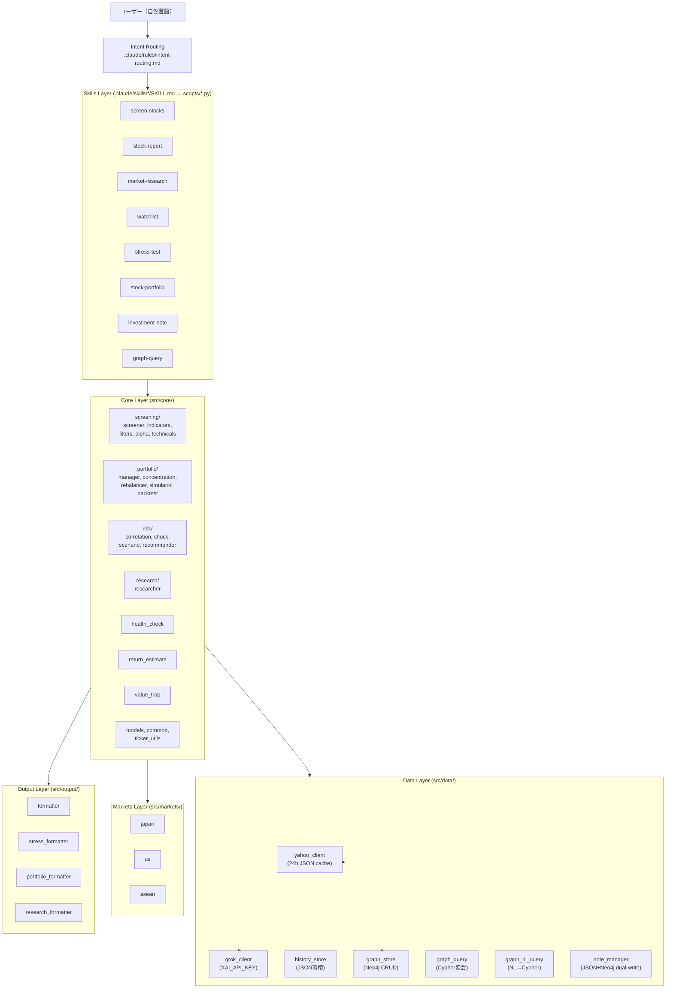

# Architecture

## System Overview

自然言語ファーストの投資分析システム。ユーザーは日本語で意図を伝えるだけで、スクリーニング・個別銘柄分析・ポートフォリオ管理・リスク評価・知識グラフ照会が自動実行される。

Claude Code Skills として動作し、Yahoo Finance API (yfinance) + Grok API (X/Web検索) + Neo4j (知識グラフ) を統合。

---

## Layer Architecture



---

## Data Flow

```
1. ユーザー発言
   ↓
2. Intent Routing (intent-routing.md)
   ├─ ドメイン判定（発見/分析/保有管理/リスク/監視/記録/知識/メタ）
   └─ スキル選択 + パラメータ推定
   ↓
3. Skill Script (scripts/*.py)
   ├─ argparse CLI
   └─ sys.path.insert で src/ を import
   ↓
4. Core Module (src/core/)
   ├─ ビジネスロジック実行
   └─ Data Layer 経由でデータ取得
   ↓
5. Data Layer (src/data/)
   ├─ yahoo_client: yfinance + 24h JSON cache
   ├─ grok_client: Grok API (X/Web検索)
   ├─ graph_store: Neo4j CRUD (MERGE ベース)
   └─ history_store: 実行結果の JSON 蓄積
   ↓
6. Output Layer (src/output/)
   └─ Markdown テーブル/レポートとして整形
   ↓
7. 結果表示 + history_store/graph_store に自動蓄積
```

---

## Design Principles

### 1. Natural Language First
ユーザーインターフェースは自然言語。スラッシュコマンドは内部実装であり、ユーザーには見えない。`intent-routing.md` がすべての入口。

### 2. Dual-Write Pattern (JSON master + Neo4j view)
- JSON ファイルが master データソース（常に書き込み成功）
- Neo4j は view（検索・関連付け用）。try/except で graceful degradation
- Neo4j が落ちても全機能が動作する

### 3. HAS_MODULE Graceful Degradation
スクリプト層 (run_*.py) は `try/except ImportError` で各モジュールの存在を確認:
```python
try:
    from src.data import graph_store
    HAS_GRAPH = True
except ImportError:
    HAS_GRAPH = False
```

### 4. 24h JSON Cache
`yahoo_client.py` はレスポンスを `data/cache/` に JSON キャッシュ（TTL 24時間）。APIレート制限を回避しつつ、十分な鮮度を維持。

### 5. Idempotent Graph Writes
`graph_store.py` のすべての書き込みは MERGE ベース。同じデータを複数回書き込んでも結果が変わらない。

---

## Module Summary

### Core Modules (src/core/)

| サブフォルダ | モジュール | 役割 |
|:---|:---|:---|
| screening/ | screener.py | 4つのスクリーナー (Query/Value/Pullback/Alpha) |
| screening/ | indicators.py | バリュースコア (0-100点) + 株主還元率 + 安定度 |
| screening/ | filters.py | ファンダメンタルズ条件フィルタ |
| screening/ | query_builder.py | EquityQuery 構築 |
| screening/ | alpha.py | 変化スコア (アクルーアルズ/売上加速/FCF/ROE趨勢) |
| screening/ | technicals.py | 押し目判定 (RSI/BB/バウンススコア) |
| portfolio/ | portfolio_manager.py | CSV ベースのポートフォリオ管理 |
| portfolio/ | concentration.py | HHI 集中度分析 |
| portfolio/ | rebalancer.py | リスク制約付きリバランス提案 |
| portfolio/ | simulator.py | 複利シミュレーション (3シナリオ+配当再投資+積立) |
| portfolio/ | backtest.py | 蓄積データからリターン検証 |
| portfolio/ | portfolio_simulation.py | What-If シミュレーション |
| portfolio/ | portfolio_bridge.py | PF CSV → ストレステスト連携 |
| risk/ | correlation.py | 日次リターン・相関行列・因子分解 |
| risk/ | shock_sensitivity.py | ショック感応度スコア |
| risk/ | scenario_analysis.py | シナリオ分析 (実行ロジック) |
| risk/ | scenario_definitions.py | 8シナリオ + ETF資産クラス定義 |
| risk/ | recommender.py | ルールベース推奨アクション |
| research/ | researcher.py | yfinance + Grok API 統合リサーチ |
| (root) | health_check.py | 3段階アラート + クロス検出 + 還元安定度 |
| (root) | return_estimate.py | アナリスト + 過去リターン + ニュース + Xセンチメント |
| (root) | value_trap.py | バリュートラップ検出 |
| (root) | models.py | dataclass 定義 |
| (root) | common.py | 共通ユーティリティ |
| (root) | ticker_utils.py | ティッカー推論 (通貨/地域マッピング) |

### Data Modules (src/data/)

| モジュール | 役割 |
|:---|:---|
| yahoo_client.py | yfinance ラッパー + 24h JSON cache + 異常値ガード |
| grok_client.py | Grok API (X検索/Web検索) + XAI_API_KEY 環境変数 |
| history_store.py | スキル実行結果の JSON 自動蓄積 (data/history/) |
| graph_store.py | Neo4j CRUD (11ノードタイプ, MERGE ベース) |
| graph_query.py | Neo4j 照会ヘルパー (6関数) |
| graph_nl_query.py | 自然言語 → Cypher テンプレートマッチ |
| note_manager.py | 投資メモ管理 (JSON + Neo4j dual-write) |

### Config

| ファイル | 内容 |
|:---|:---|
| config/screening_presets.yaml | 7プリセット定義 |
| config/exchanges.yaml | 60+ 地域の取引所・閾値定義 |
