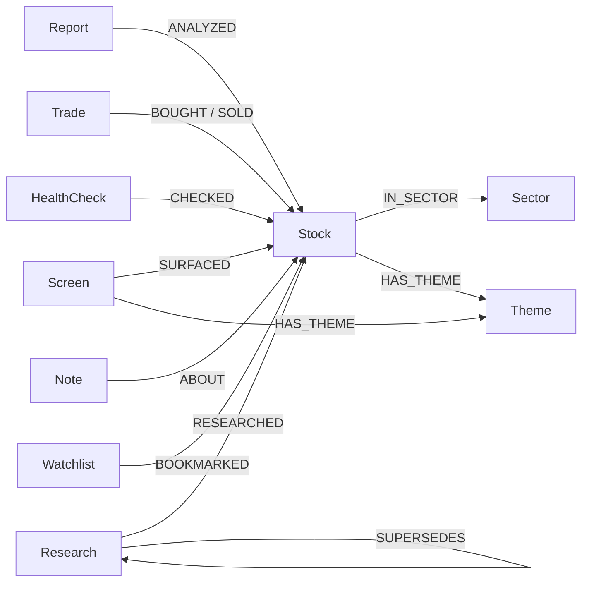

# Neo4j Knowledge Graph Schema

投資ナレッジグラフのスキーマリファレンス。`src/data/graph_store.py` が定義・管理する。

---

## Node Types (11)

### Stock
中心ノード。すべてのアクティビティがこのノードに接続される。

| Property | Type | Description |
|:---|:---|:---|
| symbol | string (UNIQUE) | ティッカーシンボル (e.g. 7203.T, AAPL) |
| name | string | 銘柄名 |
| sector | string | セクター |
| country | string | 国 |

### Screen
スクリーニング実行結果。

| Property | Type | Description |
|:---|:---|:---|
| id | string (UNIQUE) | `screen_{date}_{region}_{preset}` |
| date | string | 実行日 (YYYY-MM-DD) |
| preset | string | プリセット名 (alpha, value, etc.) |
| region | string | 地域 (japan, us, etc.) |
| count | int | ヒット件数 |

### Report
個別銘柄レポート。

| Property | Type | Description |
|:---|:---|:---|
| id | string (UNIQUE) | `report_{date}_{symbol}` |
| date | string | 実行日 |
| symbol | string | 対象銘柄 |
| score | float | バリュースコア (0-100) |
| verdict | string | 判定 (割安/適正/割高) |

### Trade
売買記録。

| Property | Type | Description |
|:---|:---|:---|
| id | string (UNIQUE) | `trade_{date}_{type}_{symbol}` |
| date | string | 取引日 |
| type | string | buy / sell |
| symbol | string | 銘柄 |
| shares | int | 株数 |
| price | float | 取引価格 |
| currency | string | 通貨 (JPY/USD/SGD) |
| memo | string | メモ |

### HealthCheck
ヘルスチェック実行結果。

| Property | Type | Description |
|:---|:---|:---|
| id | string (UNIQUE) | `health_{date}` |
| date | string | 実行日 |
| total | int | チェック対象数 |
| healthy | int | 健全銘柄数 |
| exit_count | int | EXIT 判定数 |

### Note
投資メモ。

| Property | Type | Description |
|:---|:---|:---|
| id | string (UNIQUE) | UUID |
| date | string | 作成日 |
| type | string | thesis/observation/concern/review/target/lesson |
| content | string | メモ内容 |
| source | string | 情報ソース |

### Theme
銘柄に付けられたテーマタグ。

| Property | Type | Description |
|:---|:---|:---|
| name | string (UNIQUE) | テーマ名 (e.g. AI, EV, 半導体) |

### Sector
セクター分類。

| Property | Type | Description |
|:---|:---|:---|
| name | string (UNIQUE) | セクター名 (e.g. Technology, Healthcare) |

### Research
深掘りリサーチ結果。

| Property | Type | Description |
|:---|:---|:---|
| id | string (UNIQUE) | `research_{date}_{type}_{target}` |
| date | string | 実行日 |
| research_type | string | stock/industry/market/business |
| target | string | 対象 (銘柄/業界名/市場名) |
| summary | string | 要約 |

### Watchlist
ウォッチリスト。

| Property | Type | Description |
|:---|:---|:---|
| name | string (UNIQUE) | リスト名 |

### MarketContext
市況スナップショット。

| Property | Type | Description |
|:---|:---|:---|
| id | string (UNIQUE) | `market_context_{date}` |
| date | string | 取得日 |
| indices | string (JSON) | 指数データ (JSON 文字列) |

---

## Relationships



| Relationship | From | To | Description |
|:---|:---|:---|:---|
| SURFACED | Screen | Stock | スクリーニングで検出された |
| ANALYZED | Report | Stock | レポートで分析された |
| BOUGHT | Trade | Stock | 購入取引 |
| SOLD | Trade | Stock | 売却取引 |
| CHECKED | HealthCheck | Stock | ヘルスチェック対象 |
| ABOUT | Note | Stock | メモの対象銘柄 |
| IN_SECTOR | Stock | Sector | セクター分類 |
| HAS_THEME | Stock/Screen | Theme | テーマタグ |
| RESEARCHED | Research | Stock | リサーチ対象 (stock/business タイプのみ) |
| BOOKMARKED | Watchlist | Stock | ウォッチ対象 |
| SUPERSEDES | Research | Research | 同じ対象の新旧リサーチチェーン (日付順) |

---

## Constraints (11)

```cypher
CREATE CONSTRAINT stock_symbol IF NOT EXISTS FOR (s:Stock) REQUIRE s.symbol IS UNIQUE
CREATE CONSTRAINT screen_id IF NOT EXISTS FOR (s:Screen) REQUIRE s.id IS UNIQUE
CREATE CONSTRAINT report_id IF NOT EXISTS FOR (r:Report) REQUIRE r.id IS UNIQUE
CREATE CONSTRAINT trade_id IF NOT EXISTS FOR (t:Trade) REQUIRE t.id IS UNIQUE
CREATE CONSTRAINT health_id IF NOT EXISTS FOR (h:HealthCheck) REQUIRE h.id IS UNIQUE
CREATE CONSTRAINT note_id IF NOT EXISTS FOR (n:Note) REQUIRE n.id IS UNIQUE
CREATE CONSTRAINT theme_name IF NOT EXISTS FOR (t:Theme) REQUIRE t.name IS UNIQUE
CREATE CONSTRAINT sector_name IF NOT EXISTS FOR (s:Sector) REQUIRE s.name IS UNIQUE
CREATE CONSTRAINT research_id IF NOT EXISTS FOR (r:Research) REQUIRE r.id IS UNIQUE
CREATE CONSTRAINT watchlist_name IF NOT EXISTS FOR (w:Watchlist) REQUIRE w.name IS UNIQUE
CREATE CONSTRAINT market_context_id IF NOT EXISTS FOR (m:MarketContext) REQUIRE m.id IS UNIQUE
```

## Indexes (8)

```cypher
CREATE INDEX stock_sector IF NOT EXISTS FOR (s:Stock) ON (s.sector)
CREATE INDEX screen_date IF NOT EXISTS FOR (s:Screen) ON (s.date)
CREATE INDEX report_date IF NOT EXISTS FOR (r:Report) ON (r.date)
CREATE INDEX trade_date IF NOT EXISTS FOR (t:Trade) ON (t.date)
CREATE INDEX note_type IF NOT EXISTS FOR (n:Note) ON (n.type)
CREATE INDEX research_date IF NOT EXISTS FOR (r:Research) ON (r.date)
CREATE INDEX research_type IF NOT EXISTS FOR (r:Research) ON (r.research_type)
CREATE INDEX market_context_date IF NOT EXISTS FOR (m:MarketContext) ON (m.date)
```

---

## Sample Cypher Queries

### 1. 銘柄の全履歴を取得
```cypher
MATCH (s:Stock {symbol: "7203.T"})
OPTIONAL MATCH (sc:Screen)-[:SURFACED]->(s)
OPTIONAL MATCH (r:Report)-[:ANALYZED]->(s)
OPTIONAL MATCH (t:Trade)-[:BOUGHT|SOLD]->(s)
OPTIONAL MATCH (n:Note)-[:ABOUT]->(s)
RETURN s, collect(DISTINCT sc) AS screens,
       collect(DISTINCT r) AS reports,
       collect(DISTINCT t) AS trades,
       collect(DISTINCT n) AS notes
```

### 2. 繰り返しスクリーニングに出るが未購入の銘柄
```cypher
MATCH (sc:Screen)-[:SURFACED]->(s:Stock)
WHERE NOT exists { MATCH (:Trade)-[:BOUGHT]->(s) }
WITH s.symbol AS symbol, count(sc) AS cnt, max(sc.date) AS last_date
WHERE cnt >= 2
RETURN symbol, cnt, last_date
ORDER BY cnt DESC
```

### 3. 直近のリサーチ SUPERSEDES チェーン
```cypher
MATCH (r:Research {research_type: "stock", target: "7203.T"})
RETURN r.date AS date, r.summary AS summary
ORDER BY r.date DESC LIMIT 5
```

### 4. 特定テーマに関連する銘柄一覧
```cypher
MATCH (s:Stock)-[:HAS_THEME]->(t:Theme {name: "AI"})
RETURN s.symbol, s.name, s.sector
```

### 5. ある銘柄の取引履歴 + メモ
```cypher
MATCH (t:Trade)-[:BOUGHT|SOLD]->(s:Stock {symbol: "AAPL"})
RETURN t.date, t.type, t.shares, t.price
ORDER BY t.date DESC
UNION ALL
MATCH (n:Note)-[:ABOUT]->(s:Stock {symbol: "AAPL"})
RETURN n.date, n.type AS type, n.content AS content, null AS price
ORDER BY n.date DESC
```

---

## Dual-Write Pattern

```
User Action (e.g. buy)
  │
  ├─ 1. JSON Write (master) ← 必ず成功
  │     portfolio.csv / data/notes/*.json / data/history/*.json
  │
  └─ 2. Neo4j Write (view) ← try/except, 失敗しても OK
        graph_store.merge_trade() / merge_note() / etc.
```

- JSON ファイルが master データソース。すべての read/write は JSON 経由
- Neo4j は検索・関連付け用の view。`graph_store.py` の全関数は例外を握りつぶして `False` を返す
- Neo4j が落ちていても全スキルが正常動作する
